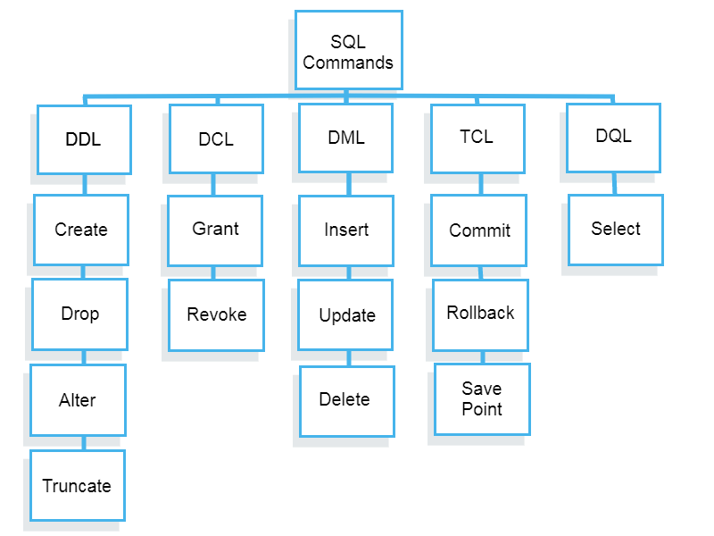

# Overview

- SQL là viết tắt của Structured Query Language
- SQL là ngôn ngữ truy vấn có cấu trúc, cho phép bạn truy cập và thao tác với các cơ sở dữ liệu để tạo, xóa, sửa đổi, trích xuất dữ liệu.
- SQL là một ngôn ngữ tiêu chuẩn cho việc xử lý dữ liệu trong các hệ thống quản trị cơ sở dữ liệu quan hệ (RDBMS)
- SQL được phát triển bởi IBM vào những năm 1970.
- Các hệ thống quản trị cơ sở dữ liệu như MySql, MS Access, Oracle, Sybase, Informix, Postgres hay SQL Server đều lấy SQL làm ngôn ngữ cơ sở dữ liệu tiêu chuẩn.
- Càng về sau này thì các ứng dụng đòi hỏi phải có tốc độ xử lý dữ liệu ngày càng nhanh, dẫn đến sự nổi lên của NoSQL(cơ sở dữ liệu phi quan hệ): MapReduce và Bigtable, Cassandra, MongoDB, và nhiều nữa.

# Components

- Dưới đây là năm loại truy vấn SQL được sử dụng rộng rãi.

`SQL có nhiều hệ quản trị cơ sở dữ liệu khác nhau như Oracle Database, Microsoft SQL Server và MySQL. Mặc dù chúng khác nhau về nhiều mặt, nhưng tất cả các cơ sở dữ liệu SQL sử dụng các lệnh ngôn ngữ chung - SQL.`



## Ngôn ngữ Định nghĩa Dữ liệu (Data Definition Language)

- Các câu lệnh DDL được sử dụng để định nghĩa và quản lý cấu trúc của cơ sở dữ liệu và các đối tượng của nó.
- Các lệnh bao gồm :
    - CREATE: Tạo bảng, chỉ mục, hoặc các đối tượng khác trong cơ sở dữ liệu.
    ```
    CREATE TABLE table_name (
        column1 datatype,
        column2 datatype,
        ...
    );
    ```
    
    - ALTER: Thay đổi cấu trúc của bảng hiện có, như thêm hoặc xóa cột.
    ```
    ALTER TABLE table_name ADD column_name datatype;
    ```

    - DROP: Xóa bảng hoặc các đối tượng khác trong cơ sở dữ liệu.
    ```
    DROP TABLE table_name;
    ```

    - TRUNCATE: Xóa tất cả các hàng từ một bảng mà không xóa cấu trúc của bảng (giải phóng không gian chứa bảng).
    ```
    TRUNCATE TABLE table_name;
    ```

## Ngôn ngữ Thao tác Dữ liệu (Data Manipulation Language)

- Các câu lệnh DML được sử dụng để thao tác và quản lý dữ liệu trong các bảng.
- Các lệnh này bao gồm :
    - INSERT: chèn dữ liệu vào bảng
    ```
    INSERT INTO table_name (column1, column2) VALUES (value1, value2);
    ```

    - UPDATE: sửa đổi giá trị của một cột trong bảng
    ```
    UPDATE table_name SET column1 = value1, column2 = value2 WHERE condition;
    ```

    - DELETE: xóa một hoặc nhiều hàng khỏi bảng
    ```
    DELETE FROM table_name WHERE condition;
    ```

## Ngôn ngữ Kiểm soát Dữ liệu (Data Control Language)

- Các câu lệnh DCL được sử dụng để kiểm soát quyền truy cập vào dữ liệu trong cơ sở dữ liệu.
    - GRANT: Cấp quyền truy cập cho người dùng.
    ```
    GRANT SELECT, INSERT ON table_name TO user_name;
    ```

    - REVOKE: Thu hồi quyền truy cập đã cấp cho người dùng.
    ```
    REVOKE SELECT, INSERT ON table_name FROM user_name;
    ```

## Ngôn ngữ truy vấn dữ liệu (Data Queries Language)

- Cho phép bạn truy xuất dữ liệu từ cơ sở dữ liệu. 
    - SELECT: Truy vấn dữ liệu từ các bảng.
    ```
    SELECT column1, column2 FROM table_name;
    ```

## Ngôn ngữ kiểm soát giao dịch (Transaction Control Language)

- Các câu lệnh TCL được sử dụng để quản lý các giao dịch trong cơ sở dữ liệu.
    - COMMIT: Lưu tất cả các thay đổi được thực hiện trong một giao dịch.
    - ROLLBACK: Hủy bỏ tất cả các thay đổi được thực hiện trong một giao dịch.
    - SAVEPOINT: Tạo điểm lưu trong một giao dịch để có thể quay lại.

https://www.guru99.com/vi/sql-commands-dbms-query.html
